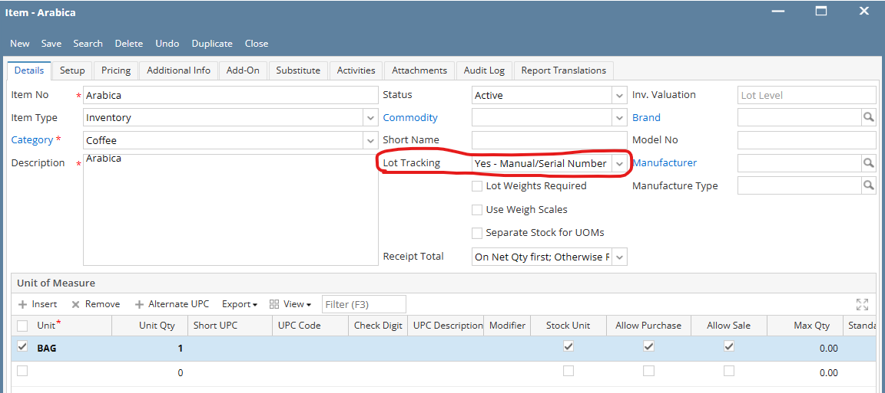
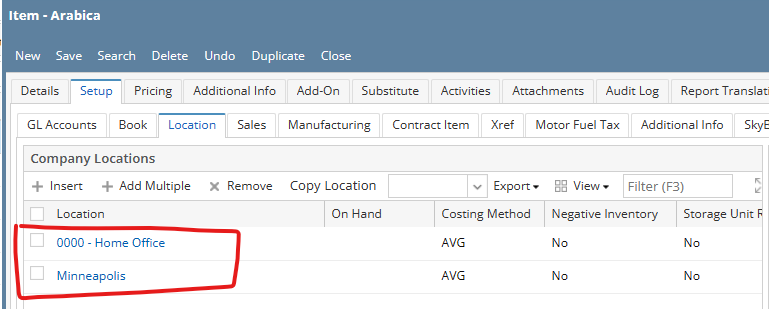
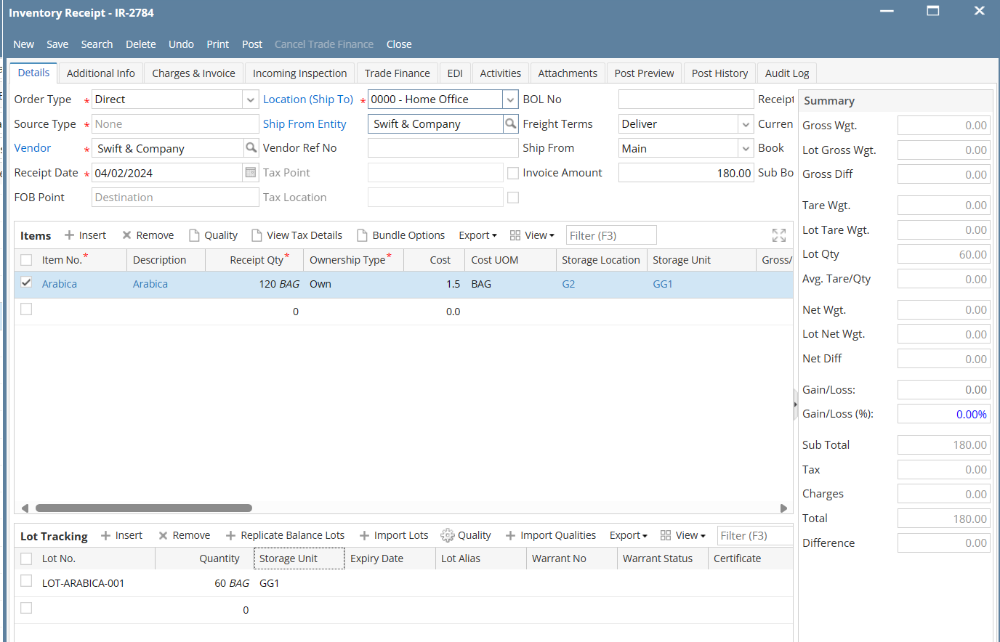

# Call an API to create a receipt for a lotted item

## Pre-conditions:

We will do these pre-conditions in the i21 app.
1. An item is lotted when the `Lot Tracking` field is not set to `No`. We will create an inventory item and set the `Lot Tracking` field to any of the following below.
    - `Yes - Serial Number`
    - `Yes - Manual`
    - `Yes - Manual/Serial Number`

    
Uncheck the `Lot Weights Required` checkbox. This is used only for items that requires a weight unit.
2. Configure the company locations for that newly-created lotted item.


## Create `receipt` POST endpoint

### Get the lookup IDs need for the `receipt` POST endpoint

1. **Vendor**. We need to get the `entityId` from the `vendor` endpoint. In this example, we will use the `Swift  & Company`. The `id` of this vendor is `ABC`, we can use it to filter the list. Then we get the `entityId` of `2278`.

    Request:

    ```http
    GET {{url}}/vendor
        ?filter={'groupOp': 'And', 'rules': [{'op': 'eq', 'field': 'id', 'data': 'ABC'}]}
        &fields=entityId,id,entity
    Content-Type: application/json
    Authorization: Bearer {{access_token}}
    ```
    Response:
    ```json
    {
        "data": [
            {
                "entityId": 2278,
                "id": "ABC",
                "entity": {
                    "entityId": 2278,
                    "entityNo": "ABC",
                    "entityName": " Swift & Company"
                }
            }
        ],
        "count": 1,
        "currentPage": 1,
        "pageSize": 50,
        "totalPages": 1,
        "totalValueInPage": null,
        "totalValue": null,
        "totalValueFieldName": null,
        "disablePaging": null
    }
    ```
2. **Location/Ship To**. We need to get the company location ID from the `companylocation` endpoint. We can add filtering so it only returns the location information we need. In this example, we will choose `0000 - Home Office`. 

    We will need the value of the `locationId` property when creating a receipt. In this example, the `locationId` is `1`.

    Request:
    ```http
    GET {{url}}/companylocation
    ?filter={'groupOp': 'And', 'rules': [{'op': 'eq', 'field': 'locationName', 'data': '0000 - Home Office'}]}
    &fields=locationId,locationName,locationNumber,storageLocations
    Content-Type: application/json
    Authorization: Bearer {{access_token}}
    ```
    Response:
    ```json
    {
        "data": [
            {
                "locationId": 1,
                "locationName": "0000 - Home Office",
                "locationNumber": "009",
                "storageLocations": [
                    {
                        "vendorId": null,
                        "vendor": null,
                        "classification": "Inventory",
                        "address": "",
                        "city": "",
                        "state": "",
                        "zipCode": "",
                        "countryId": null,
                        "country": null,
                        "latitude": 0.0,
                        "longitude": 0.0,
                        "storageLocationId": 153,
                        "name": "Gas Tank",
                        "description": "Link to TM Site",
                        "locationId": 1
                    },
                    {
                        "vendorId": null,
                        "vendor": null,
                        "classification": "Inventory",
                        "address": "",
                        "city": "",
                        "state": "",
                        "zipCode": "",
                        "countryId": null,
                        "country": null,
                        "latitude": 0.0,
                        "longitude": 0.0,
                        "storageLocationId": 198,
                        "name": "G2",
                        "description": "iSite1",
                        "locationId": 1
                    }
                ]
            }
        ],
        "count": 1,
        "currentPage": 1,
        "pageSize": 50,
        "totalPages": 1,
        "totalValueInPage": null,
        "totalValue": null,
        "totalValueFieldName": null,
        "disablePaging": null
    }
    ```

    The `shipFromEntityId` is optional and defaults to the value of the `entityId` of the selected vendor. But we can specify a different `shipFromEntityId` using the `entityId` from the `vendor` endpoint.

3. **Currency**. Get the ID of the currency. We can add filtering to narrow the results. We will use the `internalId` to get the ID of the currency.

    Request:

    ```http
    GET {{url}}/currency
	?filter={'groupOp': 'And', 'rules': [{'op': 'eq', 'field': 'id', 'data': 'USD'}]}
	&fields=internalId, id as code,description
    Content-Type: application/json
    Authorization: Bearer {{access_token}}
    ```
    Response:

    ```json
    {
        "data": [
            {
                "internalId": 3,
                "code": "USD",
                "description": "US Dollar"
            }
        ],
        "count": 1,
        "currentPage": 1,
        "pageSize": 50,
        "totalPages": 1,
        "totalValueInPage": null,
        "totalValue": null,
        "totalValueFieldName": null,
        "disablePaging": null
    }
    ```

3. **Storage Location**. We need to get the `storageLocationId`. Storage locations and storage units are required when creating a receipt for lotted items.

    The JSON response of the `companylocation` endpoint includes an array of **storageLocations**. We can use that list to get the ID of the storage location. In this example, we will select `G2` as the storage location. Based on the JSON response above, the ID of the storage location is `198`. Alternatively, we can call a separate endpoint, `receipt/storagelocation?locationId=1` endpoint with a `locationId` query parameter to get the ID of the storage location.

4. **Storage Unit**. We can get the storage unit using the `receipt/storageunit?storageLocationId=198` endpoint by supplying the `storageLocationId` query parameter. In this example, we will retrieve the `GG1` storage unit of the `G2` storage location. We can add a filtering to get the specific storage unit. The `storageUnitId` we get is `170`.

    Request:
    ```http
    GET {{url}}/receipt/storageunit
	?storageLocationId=198
	&filter={'groupOp': 'And', 'rules': [{'op': 'eq', 'field': 'name', 'data': 'GG1'}]}
	&fields=storageUnitId,name,description,locationName
    Content-Type: application/json
    Authorization: Bearer {{access_token}}
    ```
    Response:
    ```json
    {
        "data": [
            {
                "storageUnitId": 170,
                "name": "GG1",
                "description": "GG1",
                "locationName": "0000 - Home Office"
            }
        ],
        "count": 1,
        "currentPage": 1,
        "pageSize": 50,
        "totalPages": 1,
        "totalValueInPage": null,
        "totalValue": null,
        "totalValueFieldName": null,
        "disablePaging": null
    }
    ```

5. **Item**. Next, we need to get the `itemId` of the lotted item. We will need to use the `item` endpoint and add a filter to narrow down the results. In this example, we will provide a `locationId` query parameter to filter the items that belongs to the company location, which we've selected in the previous steps. We can also add a filter rule to search for the `Arabica` item using the `itemNo` field. Lastly, we can show only the lotted item by adding a filter rule for the `lotTracking` field.

    Request:
    ```http
    GET {{url}}/item
	?locationId=1
	&filter={'groupOp': 'And', 'rules': [{'op': 'eq', 'field': 'itemNo', 'data': 'Arabica'}, { 'op': 'ne', 'field': 'lotTracking', 'data': 'No' }]}
	&fields=itemId,itemNo,description,lotTracking
    Content-Type: application/json
    Authorization: Bearer {{access_token}}
    ```
    ```json
    {
        "data": [
            {
                "itemId": 8049,
                "itemNo": "Arabica",
                "description": "Arabica",
                "lotTracking": "Yes - Manual/Serial Number"
            }
        ],
        "count": 1,
        "currentPage": 1,
        "pageSize": 50,
        "totalPages": 1,
        "totalValueInPage": null,
        "totalValue": null,
        "totalValueFieldName": null,
        "disablePaging": null
    }
    ```

6. **Receive UOM**. To get the `receiveUOMId`, we can issue a request to the `uom` endpoint by filtering the UOM code to get the specific UOM that we need. In this example, we will use the `Bag` unit, the `uomId` is `79`.

    If we need to get the list of valid UOMs of an item, we can use the `item` endpoint and inspect the `uOMs` array.

    Request:
    ```http
    GET {{url}}/uom?filter={'groupOp': 'And', 'rules': [{'op': 'eq', 'field': 'id', 'data': 'Bag'}]}
    Content-Type: application/json
    Authorization: Bearer {{access_token}}
    ```
    Response:
    ```json
    {
        "data": [
            {
                "uomId": 79,
                "id": "BAG",
                "symbol": "BAG",
                "unitType": "Quantity",
                "dateCreated": null,
                "dateLastUpdated": null,
                "dateModified": null,
                "decimalPlaces": 6,
                "internalId": 79
            }
        ],
        "count": 1,
        "currentPage": 1,
        "pageSize": 50,
        "totalPages": 1,
        "totalValueInPage": null,
        "totalValue": null,
        "totalValueFieldName": null,
        "disablePaging": null
    }
    ```
### Finally, we can compose a `receipt` POST request

- Vendor Entity ID = 2278
- Location Id = 1
- Currency Id = 3
- Storage Location Id = 198
- Storage Unit Id = 170
- Item Id = 8049
- ReceiveUOMId = 79

We can provide an arbitrary `lotNo` to the lot object in the `lots` array. It doesn't necessarily need to be existing. The system will auto-create the lot number if it doesn't exists. Note that the `quantity` of the lot must be less than or equal to the `receiveQty` of the item.

In this example, our `receipt` POST request created a new IR: `IR-2785`.

POST request with JSON payload:
```http
POST {{url}}/receipt
Content-Type: application/json
Authorization: Bearer {{access_token}}
```
```json
{
  "data": [
    {
      "entityId": 2278,
      "locationId": 1,
      "receiptDate": "2024-04-02",
      "orderType": "Direct",
	  "description": "Receipt for Arabica",
      "items": [
        {
          "itemId": 8049,
		  "cost": 1.5,
          "receiveQty": 120.00,
		  "receiveUOMId": 79,
		  "storageLocationId": 198,
		  "storageUnitId": 170,
		  "lots": [
			{
				"lotNo": "LOT-ARABICA-001",
				"quantity": 60.00
			}
		  ]
        }
      ]
    }
  ]
}
```
Response:
```json
{
  "createdRecords": [
    {
      "receiptId": 3388,
      "receiptNo": "IR-2785",
      "total": 180.000000
    }
  ],
  "totalRecordsCreated": 1
}
```

